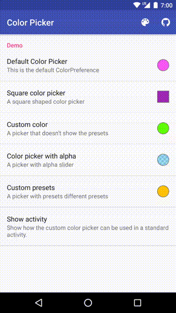
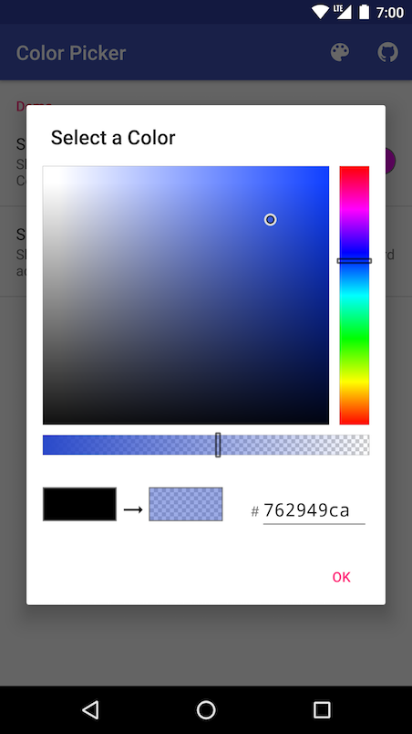

# Color Picker

Yet another open source color picker for Android. So, why should you use this color picker? It is highly customizable and easy to use. You can simply add the `ColorPreference` to your preferences and a beautiful color picker dialog will be displayed without additional code. The color picker supports alpha and allows you to set your own presets.

The original ColorPickerView was written by [Daniel Nilsson](https://github.com/danielnilsson9/color-picker-view).

## Screenshots

&nbsp;&nbsp;

Don't use this once. It is a personal project with customizations 
only for my app.

## License

    Licensed under the Apache License, Version 2.0 (the "License");
    you may not use this file except in compliance with the License.
    You may obtain a copy of the License at

       http://www.apache.org/licenses/LICENSE-2.0

    Unless required by applicable law or agreed to in writing, software
    distributed under the License is distributed on an "AS IS" BASIS,
    WITHOUT WARRANTIES OR CONDITIONS OF ANY KIND, either express or implied.
    See the License for the specific language governing permissions and
    limitations under the License.
